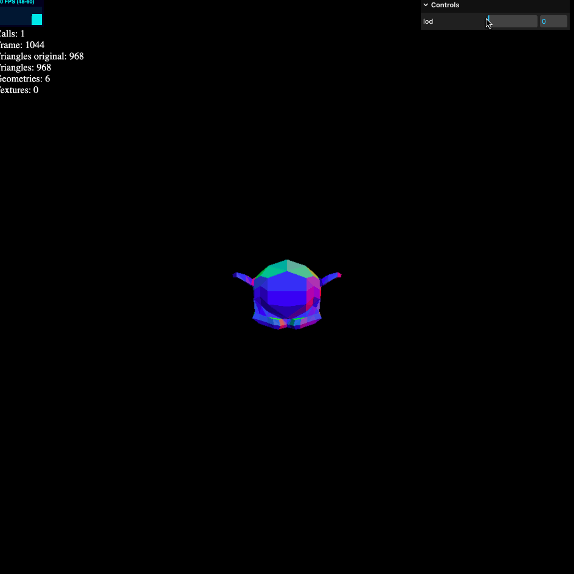

# THREE-Nanite
[Live demo](https://aifanatic.github.io/three-nanite/dist/index.html)

Note: This project is not finished and the code is not particularly clean or performant.

## Description
An attempt at reproducing a dynamic LOD in threejs similarly to unreal's nanite.
Very far from it but nonetheless a start.