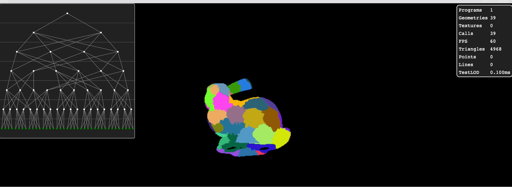
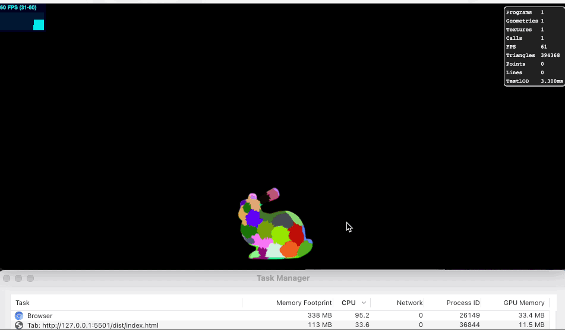

# THREE-Nanite
### Note: The code is a mess at the moment.

[Live demo](https://aifanatic.github.io/three-nanite/dist/index.html)

Photo description:
- 1: Original object.
- 2: Meshletized/Clustered: Using [METIS](https://github.com/KarypisLab/METIS).
- 3: Grouped meshlets: Partitions adjacent meshlets into groups using [METIS](https://github.com/KarypisLab/METIS).
- 4: Merged grouped meshlets: Merges meshlets using [meshoptimizer](https://github.com/zeux/meshoptimizer).
- 5: Simplification: Simplify the mesh using [meshoptimizer](https://github.com/zeux/meshoptimizer) (Garland 1997).
- 6: Split: Similar to step 2.

Photo description:
Meshlets shown are the red ones, as long as the edges of the DAG don't cross there should be no cracks and a dynamic LOD is achieved (1414628 and 8154144 are simplified versions of their children).

## Description
An attempt at reproducing a dynamic LOD in threejs similarly to unreal's nanite.
Very far from it but nonetheless a start.
 
For now it clusters a mesh (meshlets), then groups adjacent clusters into a group, merges the mesh (shared vertices), performs mesh simplification to half the triangles in the mesh (max 128) and finally it splits it into 2 (should be N/2).

## TODO:
- More testing on LODS and DAG cut
- Stream geometry to GPU

## References
[Nanite - A Deep Dive](https://advances.realtimerendering.com/s2021/Karis_Nanite_SIGGRAPH_Advances_2021_final.pdf)
 
[The Nanite System in Unreal Engine 5](https://www.medien.ifi.lmu.de/lehre/ws2122/gp/slides/gp-ws2122-extra-nanite.pdf)
 
[Multiresolution structures
for interactive visualization
of very large 3D datasets](https://vcg.isti.cnr.it/~ponchio/download/ponchio_phd.pdf)
 
[Batched Multi Triangulations](https://vcg.isti.cnr.it/Publications/2005/CGGMPS05/Slide_BatchedMT_Vis05.pdf)
 
[CS 418 – Streaming, Level of Detail, and Occlusion
](https://cs418.cs.illinois.edu/website/text/nanite.html)
 
[Real-Time Ray Tracing of Micro-Poly Geometry](https://cdrdv2-public.intel.com/782066/real-time-ray-tracing-micro-poly-geometry.pdf)
 
[CARROT - JGLRXAVPOK'S BLOG](https://jglrxavpok.github.io/)